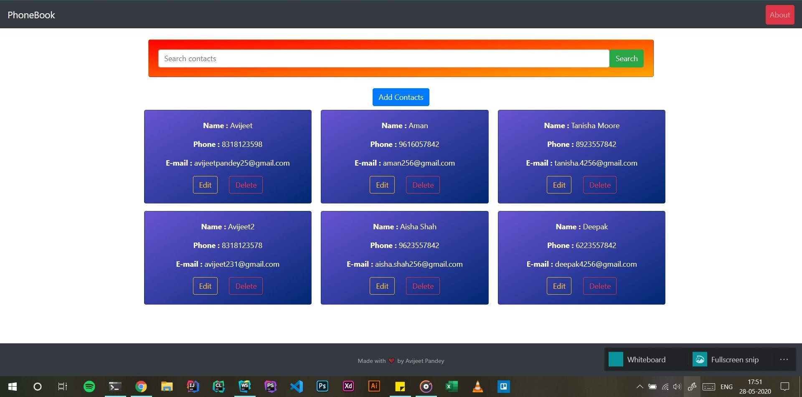

# Phone Web App using NodeJs :rocket:

## ScreenShot

## Folder structure
- [x] Controllers :- For managing application execution flow
- [x] Models :- Contains Database schema of the contacts
- [x] Public :- Contains assests , stylesheet 
- [x] Routes :- Controls the routing of the web app
- [x] Views :- Contains the frontend of the application
- [x] Sever.log :- Contains server logs 

## Stack Used :muscle:
- [x] NodeJs , Express , EJS (templating engine)
- [x] MongoDB for database

## How to run on local machine ?
> - **Clone the repository**
> - **run npm install**
> - **run npm start** ( to start the server )

## API Features 
- [x] User can create contacts 
- [x] User can delete contacts
- [x] User can update contacts

### API endpoints
-[x] **Create new contact :** router.post("/contacts/",createContact);
-[x] **Update contact :** router.put("/contacts/update/:name",updateContact);
-[x] **delete contact :** router.post("/contacts/delete/:name",deleteContact);
-[x] **get contacts :** router.get("/contacts/",getAllContacts);

## Known issues
- [x] problem integrating update on the frontend side ( been implemented on the backend)
